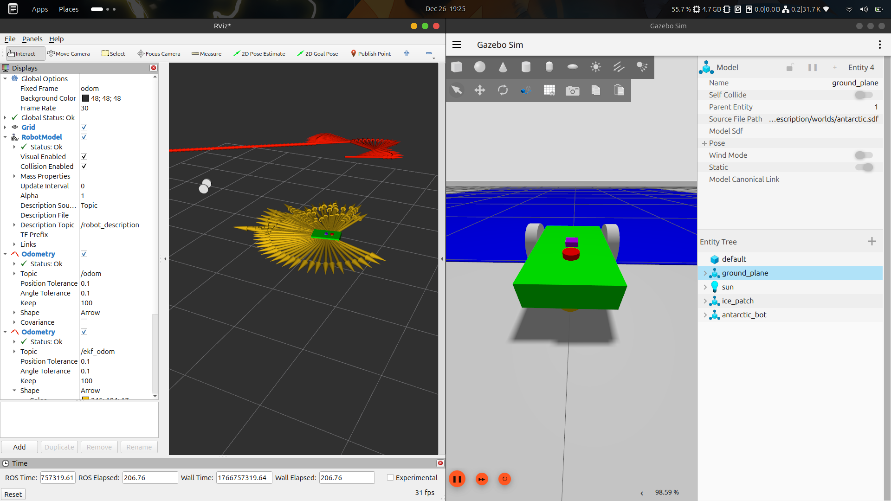

# Adaptive EKF Sensor Fusion for Antarctic Rover 🤖❄️


-red)

A robust **5-DOF Extended Kalman Filter (EKF)** designed for reliable navigation of a mobile robot on **low‑friction (ice) terrains**. The system addresses the classic **Kidnapped Robot / Wheel Slip problem** using **Adaptive Measurement Covariance Scaling**, fusing **Wheel Odometry, IMU, and GPS** data in ROS 2.

---

## 📌 Project Overview

Traditional EKF-based localization assumes consistent wheel–ground contact. On ice:

1. Wheels spin rapidly → reported velocity is high
2. Robot barely moves in reality
3. Standard EKF blindly trusts wheel odometry → robot "teleports" on the map

<p align="center">
  
</p>

<p align="center">
  <em>Adaptive EKF rejecting wheel slip on ice (Yellow: EKF, Red: Raw Odometry)</em>
</p>


### ✅ Solution: Adaptive EKF

This project implements an **Adaptive EKF** that:

* Continuously compares **IMU angular velocity** with **wheel odometry**
* Detects wheel slip in real time
* Dynamically inflates the **measurement noise covariance (R)** for wheel sensors
* Forces the filter to rely on the **motion model + GPS anchor** during slip

Result: **stable localization even on ice** ❄️

---

## 🧠 Mathematical Model

### 1️⃣ State Vector

We track a **5‑DOF state vector**:

$$
\mathbf{x} = \begin{bmatrix} x & y & \theta & v & \omega \end{bmatrix}^T
$$

| State | Description              |
| ----- | ------------------------ |
| x, y  | Global position (meters) |
| θ     | Yaw angle (radians)      |
| v     | Linear velocity (m/s)    |
| ω     | Angular velocity (rad/s) |

---

### 2️⃣ Slip Detection Logic

Slip is detected during the **EKF update step** by comparing wheel and IMU angular velocities.

```cpp
error = abs(w_wheels - w_imu);
if (error > 0.3)
    slipping = true;
```

---

### 3️⃣ Adaptive Covariance Scaling

When slip is detected:

$$
R_{new} = R_{default} \times 1000
$$

Kalman Gain:

$$
K = P H^T (H P H^T + R_{new})^{-1} \approx 0
$$

➡️ Wheel measurements are effectively **ignored**, preventing pose corruption.

---

## 🛠️ Installation & Dependencies

### 🔧 Prerequisites

* ROS 2 (Humble / Iron / Jazzy)
* Gazebo Sim (Ignition)
* Eigen3
* ros_gz_bridge

---

### 🔨 Build Instructions

```bash
# 1. Clone the repository
cd ~/ros2_ws/src
git clone https://github.com/your-username/adaptive_ekf_fusion.git

# 2. Install dependencies
sudo apt install ros-$ROS_DISTRO-ros-gz-sim \
                 ros-$ROS_DISTRO-ros-gz-bridge

# 3. Build workspace
cd ~/ros2_ws
colcon build --symlink-install
source install/setup.bash
```

---

## 🚀 Running the System

### 1️⃣ Launch Simulation

Starts Gazebo with ice and dirt friction zones.

```bash
ros2 launch antarctic_robot_description antarctic_world.launch.py
```

---

### 2️⃣ Run Adaptive EKF Node

```bash
ros2 run adaptive_ekf ekf_node
```

---

### 3️⃣ Visualize in RViz

* 🔴 **Red Arrow** → Raw Wheel Odometry (drifts on ice)
* 🟡 **Yellow Arrow** → Adaptive EKF Output (stable)

---

## 📁 Package Structure

```
adaptive_ekf_fusion/
├── adaptive_ekf/
│   ├── src/ekf_node.cpp        # EKF core logic (C++)
│   └── include/               # Header files
├── antarctic_robot_description/
│   ├── urdf/robot.urdf        # Robot model + sensors
│   ├── worlds/antarctic.sdf   # Ice/Dirt physics + GPS world
│   └── launch/                # Launch files
└── README.md
```

---

## ⚙️ Configuration & Troubleshooting

### 🛰️ GPS Always Publishing 0.0

Cause: Missing spherical coordinates in the Gazebo world file.

✅ **Fix:** Add this inside the `<world>` tag:

```xml
<spherical_coordinates>
  <surface_model>EARTH_WGS84</surface_model>
  <world_frame_orientation>ENU</world_frame_orientation>
  <latitude_deg>-77.85</latitude_deg>
  <longitude_deg>166.69</longitude_deg>
  <elevation>0</elevation>
  <heading_deg>0</heading_deg>
</spherical_coordinates>
```

---

### 🧱 Robot Falling Through the World

Cause: Missing ground plane collision model.

✅ **Fix:** Ensure `<model name="ground_plane">` exists in the `.sdf` file.

---

## 📊 Results

| Terrain              | Raw Odometry      | Adaptive EKF |
| -------------------- | ----------------- | ------------ |
| Dirt (High friction) | Accurate          | Accurate     |
| Ice (Low friction)   | Drifts infinitely | ✅ Stable     |

---

## 🔮 Future Improvements

* [ ] Nav2 integration for autonomous navigation
* [ ] Mahalanobis-distance based slip detection
* [ ] LiDAR fusion for obstacle avoidance


## 🙌 Acknowledgements

* ROS 2 Community
* Gazebo Sim
* Probabilistic Robotics – Thrun, Burgard, Fox
